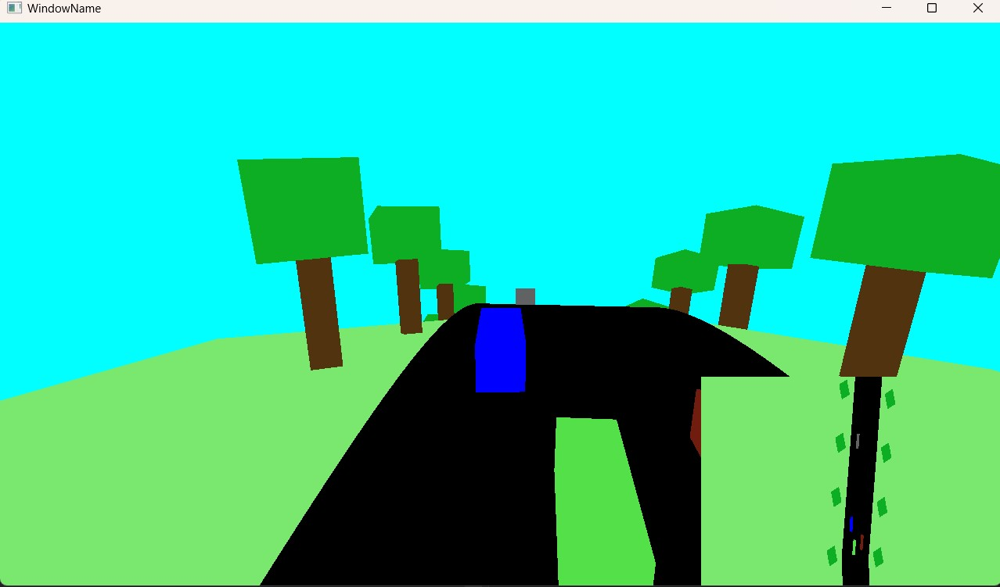
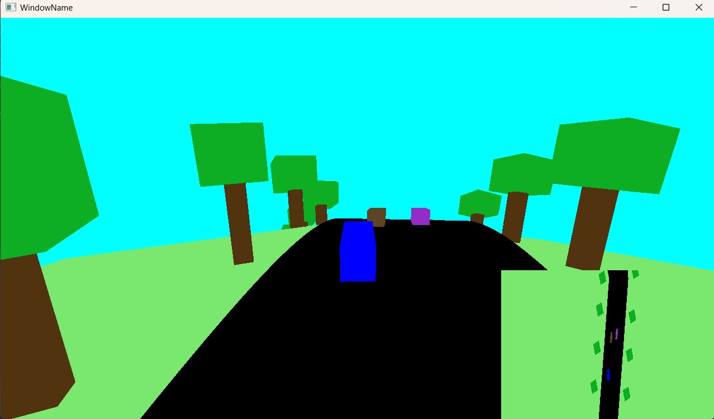

# Car-Race-In-OpenGL

- Developed a car race based game using C++, OpenGL and Graphics Design techniques.

- Implemented collision detection with opponents (which are dynamic objects) using the Sphere vs Sphere test.

- Created a complex shape of the road rendering a large density of triangles so that no visual artifacts are generated.

- Designed a curvature effect in Vertex Shader modifying the 'y' coordinate of all the objects' vertices in the scene.

Check [this](https://github.com/UPB-Graphics/gfx-framework/blob/master/README.md) out for the instructions of how to build/use this project.  

